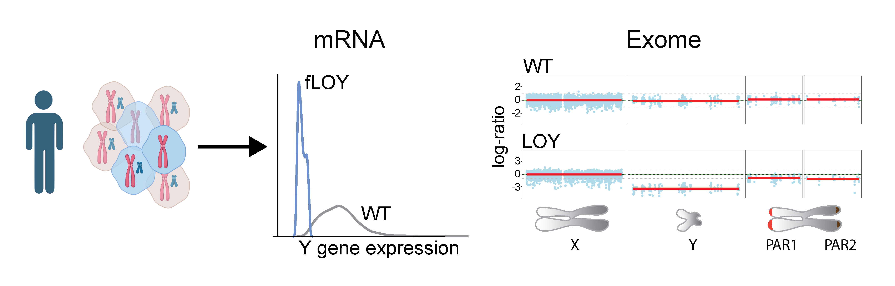
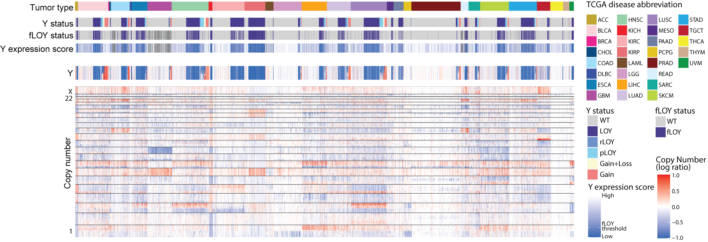

# LOY_in_primary_tumors
Code accompanying LOY manuscript

## CCLE analysis
`CCLE_LOY_analysis_GitHub.ipynb` contains analysis and figures of CCLE/DepMap gene expression and dependencies. Source files are given inside the notebook.

## Copy number variation of sex chromosomes in TCGA WES Cohort
Directory `Sex_chromsome_extension_FACETS` contains R package and scripts for analyzing copy number variations of X and Y chromosomes from WES BAM files.

**The schematic diagram**




**Copy number profiles of 5014 male tumors from TCGA**




## Publication
[Loss of chromosome Y in primary tumors](https://www.biorxiv.org/content/10.1101/2022.08.22.504831v1)

```Qi, M., Pang, J., Mitsiades, I., Lane, A. A. & Rheinbay, E. Loss of chromosome Y in primary tumors. http://biorxiv.org/lookup/doi/10.1101/2022.08.22.504831 (2022) doi:10.1101/2022.08.22.504831.```

