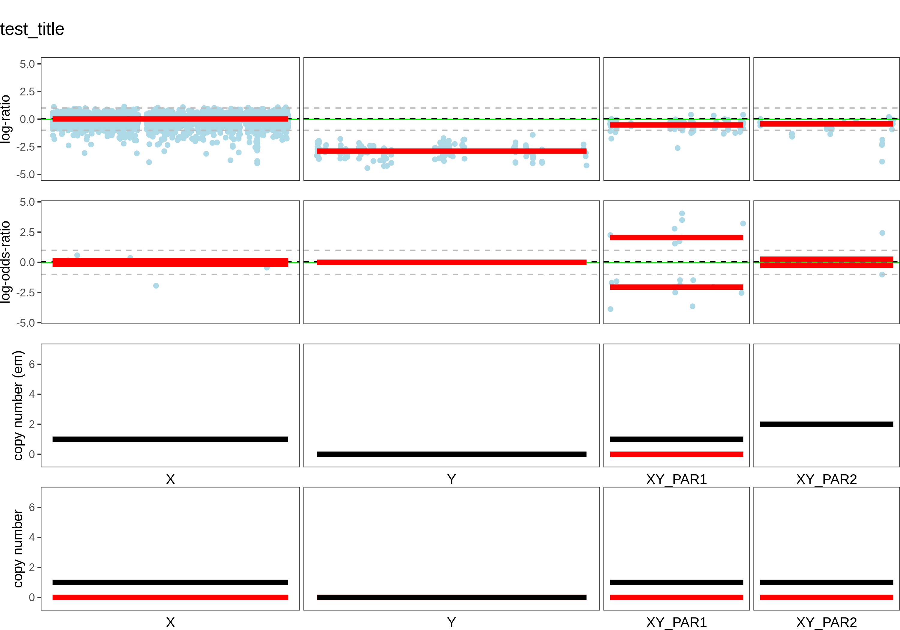
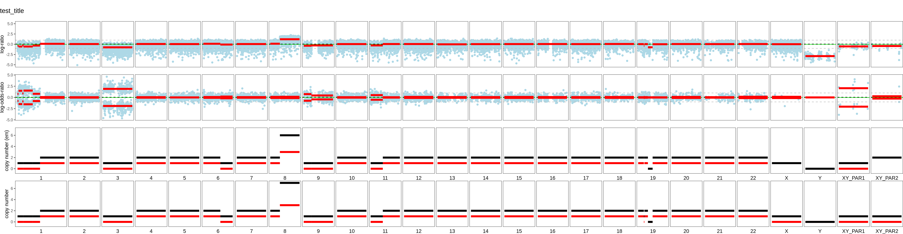

# Sex chromosome extension for FACETS
This tool is designed to analyze copy number variation (CNV) of the sex chromosomes (especially the Y chromosome) from paired tumor/normal whole-genome (WGS) and whole-exome (WEX) sequencing.
The tool uses the R package [facets](https://github.com/mskcc/facets) and the extension is described in detail in https://www.biorxiv.org/content/10.1101/2022.08.22.504831v1. The code also refers to scripts from this implementation of facets (https://github.com/vanallenlab/facets) for calling stable purity and ploidy. 

**Note:** The following guide is uses TCGA WES files aligned to the `hg19` genome assembly, but can also be applied to WGS.

## 1. Installation
There are two ways to install the package, described in detail below:
(i)  Docker image
(ii) Install yourself from source code, for example for integration into your own analysis pipelines. 


### 1.1 Docker Image

Docker image: [mqibroad/ext_sex_facets](https://hub.docker.com/r/mqibroad/terra_cny)

Workflow for snp-pileup: [wf_snp-pileup](https://portal.firecloud.org/?return=terra#methods/TCGA_CNV_sex_chromosome/snp-pileup/2)

Workflow for segmentation of sex chromosomes: [wf_CNV_XY](https://portal.firecloud.org/?return=terra#methods/TCGA_CNV_sex_chromosome/CNY_WES/5)

### 1.2 Source Code

To install the code from source, `snp-pileup` and the R package `pctGCdata` are required. For details, please see the README files in https://github.com/mskcc/facets/tree/master/inst/extcode and https://github.com/mskcc/facets.

If you have installed package `facets` before, these two tools will be installed already.

`snp-pileup` can be installed by
```bash
conda install -c bioconda snp-pileup
# or
git clone https://github.com/rheinbaylab/LOY_in_primary_tumors.git
cd LOY_in_primary_tumors/Sex_chromosome_extension_FACETS/package_extension_facets/facetschrY4/inst/extcode
g++ -std=c++11 snp-pileup.cpp -lhts -o snp-pileup
```

`pctGCdata` can be installed by
```R
remotes::install_github("mskcc/pctGCdata")
```

Install extension of facets:

```bash
https://github.com/rheinbaylab/LOY_in_primary_tumors.git
cd LOY_in_primary_tumors
R CMD INSTALL Sex_chromosome_extension_FACETS/package_extension_facets/facetschrY4
```

## 2. Usage
### 2.1 SNP-pileup
```bash
snp-pileup --verbose \
        --gzip \
        --min-map-quality ${min_map_quality} \
        --min-base-quality ${min_base_quality} \
        --min-read-counts ${min_read_counts_normal},${min_read_counts_tumor} \
        --pseudo-snps ${pseudo_snps} \
        ${db_snp_vcf} \
        ${pair_name}.pileup \
        ${normal_bam} \
        ${tumor_bam}
```
For TCGA WES datasets, the number of pseudo_snps should be set to 100.
For details of parameters, please read this [manual](https://github.com/mskcc/facets/blob/master/vignettes/FACETS.pdf).

The output file is `${pair_name}.pileup.gz`. For illustration purposes, we will use an output file named `run_extension_facets/test.pileup.gz` for downstream analyses.


### 2.2 Apply exclusion lists
This step removes regions with unusually high coverage, including regions with low mappability, ubiquitously high coverage around centromeres and ambiguously mappable regions on Y which can be also accumulate coverage in female samples. 

```
cd run_extension_facets
Rscript 02.f_remove_exclusion_list_4_snpcount.r test.pileup.gz  exclusion_lists.final.hg19.bed

```
The output file is `test.pileup.no_blk.gz`.


### 2.3 Call CNVs on the X/Y chromosomes
These scripts are executed in R command console. The genome build is modified from `hg19`, and we named it as `hg19_Y` in order to analyzing CNVs of the Y chromosomes. It's just a little different from the original genome build `hg19`. Users can get the data of `hg19_Y` easily from the code in the below.

```R
library(facetschrY4)
library(tidyverse)

# those parameters are set by users
pileup = 'test.pileup.no_blk.gz'
min_normal_depth = 20
cval = 150 # recommendation: 150 for WES, 250 for WGS
maxiter = 5
pair_name='test'
output_facets_rdata = paste(pair_name, '.facets.RData', sep='')
cncf_dataframe_filename = paste(pair_name, '.facets_cncf.tsv', sep='')
summary_dataframe_filename = paste(pair_name, '.facets_summary.tsv', sep='')
fig_genome_segments_filename_all = paste(pair_name, '.genome_segments.facets.allchr.pdf', sep='')

# load genome information
genome_build = "hg19_Y"
load(system.file("ext_genomesize", "genomesize.rda", package = "facetschrY4"))
load(system.file("ext_genomesize", "hg19_Y.rda", package = "facetschrY4"))
df_genomesize = list.genomesize[[genome_build]]
df_genomesize = df_genomesize %>% mutate(if_auto = if_else(chr_order <=22, 1, 0))

# call CNVs on Y chromosome
rcmat = readSnpMatrix(pileup)
rcmat = f_get_split_chr(rcmat, df.par, vector.chr_order)
rcmat = rcmat %>% left_join(df_genomesize %>% dplyr::select(chr_num,chr_order), by = c('Chromosome' = 'chr_num')) %>% mutate(Chromosome = chr_order)
rcmat = rcmat[,1:6]
list.out_pre = preProcSample(rcmat, ndepth = min_normal_depth, cval = cval, gbuild = "udef", ugcpct  = hg19_Y)
oo = procSample(list.out_pre, cval = cval)
fit = emcncf(oo, maxiter = maxiter)
out = oo

# save the file
cncf = fit$cncf
purity = as.numeric(signif(fit$purity, 3))
ploidy = as.numeric(signif(fit$ploidy, 3))
log_likelihood = fit$loglik
dip_log_r = oo$dipLogR
flags = oo$flags
emflags = fit$emflags

df = data.frame(pair_name=sample_name, purity=purity, ploidy=ploidy, digLogR=dip_log_r, log_likelihood = ifelse(is.null(log_likelihood), "", log_likelihood), flags = paste(flags,collapse = '|'), emflags = paste(emflags,collapse = '|'))

write.table(cncf, cncf_dataframe_filename, sep='\t', quote=FALSE, row.names=FALSE)
write.table(df, summary_dataframe_filename, sep='\t', quote=FALSE, row.names=FALSE)

save(fit, out,df, cncf,  file=output_facets_rdata)


```


### 2.4 Visualization
```bash
# usage: Rscript  f_plot_XY.r ${facets_rdata} ${output_prefix} ${sample_title}
Rscript  f_plot_XY.r test.facets.RData test test
```
This script generates CNVs for all autosomes as well as the sex chromosomes.
The output files are shown in the below (sample is `TCGA-V4-A9EE` which is downloaded from https://portal.gdc.cancer.gov/legacy-archive/search/f):

#### 2.4.1 **Only Sex chromosomes**


#### 2.4.2 **All chromsomes**



## 3. Citation
If using this tool, please both cite:

- The publication of our paper: [Loss of chromosome Y in primary tumors](https://www.biorxiv.org/content/10.1101/2022.08.22.504831v1)
- The publication of the facets package: [FACETS: allele-specific copy number and clonal heterogeneity analysis tool for high-throughput DNA sequencing](https://www.ncbi.nlm.nih.gov/pmc/articles/PMC5027494/)

Link to original facets package: https://github.com/mskcc/facets

